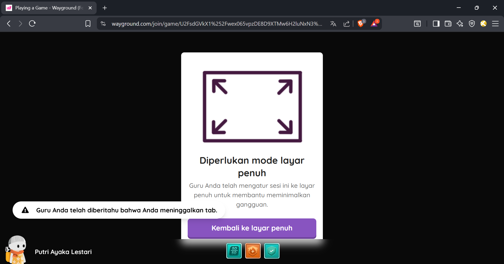
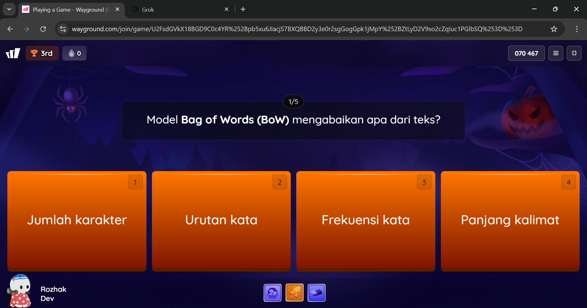

# QuizizzTabFreedom 🗝️

> *Ethical automation tool for multi-tab freedom in Quizizz/Wayground sessions. Designed for research, productivity, and educational testing only.*

## ✨ Fitur Utama

- **Tab Freedom Bypass** – Bebas switch tab tanpa deteksi Wayground  
- **CLI Profesional** – `argparse` dengan URL kustom (Quizizz & research tab)  
- **Stealth Injection** – Playwright + anti-detection scripts (focus, visibility, performance)  
- **PC-Optimized** – Non-headless, full control, real browser experience  
- **Clean & Modular** – Pythonic, async, PEP 8 compliant

## 🗂️ Struktur Direktori

```
QuizizzTabFreedom/
├── src/
│   └── quizizz_tab_freedom/
│       ├── __init__.py
│       ├── bypass.py
│       └── main.py
├── assets/
├── README.md
└── requirements.txt
```

## 🚀 Instalasi

1. **Clone repository**
   
   ```bash
   git clone https://github.com/RozhakDev/QuizizzTabFreedom.git
   cd QuizizzTabFreedom
   ```

2. **Pasang dependensi**
   
   ```bash
   pip install playwright
   playwright install   # mengunduh browser binaries
   ```

> **Catatan**: `playwright install` hanya perlu dijalankan sekali. Setelah itu tool siap dipakai.

## ▶️ Penggunaan

1. **Jalankan dengan URL default**
   
   ```bash
   python -m src.quizizz_tab_freedom.main
   ```
   
   > *Quizizz → `https://quizizz.com`*  
   > *Research → `https://google.com`*

2. **Jalankan dengan URL kustom**
   
   ```bash
   python -m src.quizizz_tab_freedom.main \
   --quizizz-url "https://wayground.com/join?gc=070467" \
   --research-url "https://grok.com"
   ```
   
   > Output:  
   > `✓ Bypass successful. Multi-tab session secured.`

> **Tips**: Tekan **Enter** kapan saja untuk menutup sesi.

## 📸 Proof of Concept

| Manual (Terbatas)                                | Script (Bebas)                               |
| ------------------------------------------------ | -------------------------------------------- |
|  |  |
| Tab switch = **deteksi instan**                  | Tab switch = **undetected**                  |
| Hanya 1 tab aktif                                | Multi-tab + research = **smooth**            |

> *Semua tes dilakukan dalam lingkungan edukasi terkontrol.*

## ⚠️ Catatan Etika

> **Proyek ini hanya untuk tujuan edukasi, riset, dan pengujian otomasi.**  
> Tidak untuk digunakan dalam ujian resmi, kecurangan, atau melanggar kebijakan platform.  
> Pengguna bertanggung jawab penuh atas penggunaan tool ini.  
> *Dibuat dengan cinta untuk kemajuan teknologi — bukan untuk merugikan.* 💙

## 

Made with dedication & ethical intent.  
*For learning, for research, for freedom — responsibly.*